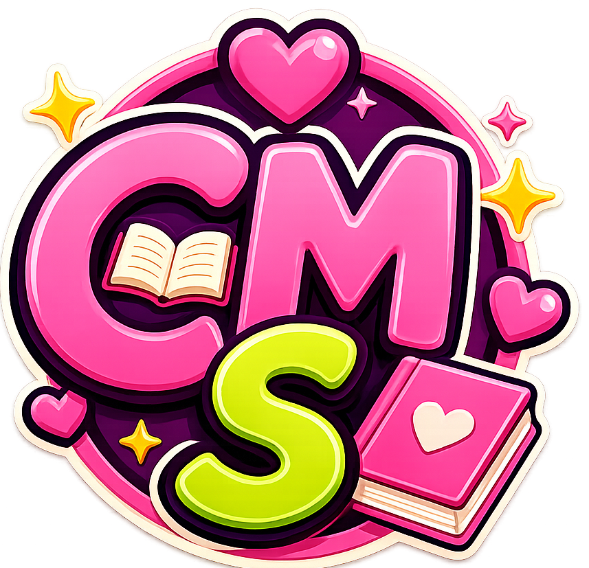

<p align="center">
  
</p>

<h1 align="center">📚 Clube das Meninas Superleitoras</h1>
<p align="center">
  <em>"Quatro amigas. Muitos livros. Uma história sendo escrita a cada encontro."</em> 💜
</p>

# 📚 Site: Clube das Meninas Superleitoras

> *"Quatro amigas. Muitos livros. Uma história sendo escrita a cada encontro."* 💜

Bem-vindo ao repositório do **Clube das Meninas Superleitoras**!

Este site foi criado para ser o diário oficial do nosso clube do livro. Aqui registramos cada capítulo da nossa história: os livros que lemos, os encontros que compartilhamos, nossas opiniões, fotos, desafios e todas as lembranças que construímos ao longo dessa jornada.

Mais do que um projeto de desenvolvimento web, este é um espaço para guardar memórias e celebrar a amizade que cresce a cada nova leitura.

---

## 🌸 Sobre o clube

O **Clube das Meninas Superleitoras** é formado por quatro amigas apaixonadas por livros e boas histórias.

Cada encontro é uma oportunidade para conversar sobre nossas leituras, compartilhar diferentes pontos de vista, rir, criar novas memórias e fortalecer nossa amizade.

Este site nasceu para registrar toda essa trajetória, permitindo que possamos reviver cada momento sempre que quisermos.

---

## ✨ O que você encontrará aqui

* 🏠 Página inicial com a apresentação do clube;
* 👭 Conheça as integrantes;
* 📖 Registro das leituras realizadas;
* ☕ Histórico dos encontros;
* 📸 Fotos e recordações;
* ⭐ Avaliações e comentários sobre os livros;
* 📚 Nossa estante literária.

---

## 💻 Tecnologias utilizadas

* HTML5
* CSS3
* JavaScript

---

## 🚀 Como visualizar o projeto

1. Clone este repositório:

```bash
git clone https://github.com/SteffaneCastro/site-clube-do-livro.git
```

2. Abra a pasta do projeto.

3. Execute o arquivo **index.html** em qualquer navegador.

---

## 🌷 Nosso propósito

Acreditamos que os livros aproximam pessoas e criam histórias que vão muito além das páginas.

Este site é o nosso cantinho para guardar cada lembrança, celebrar nossas leituras e acompanhar a evolução do clube ao longo dos anos.

Esperamos que, no futuro, possamos olhar para trás e reviver cada encontro com o mesmo carinho com que vivemos cada capítulo.

---

## 📌 Projeto em desenvolvimento

O site continuará recebendo novas funcionalidades conforme o clube cresce, como:

* Linha do tempo dos encontros;
* Metas de leitura;
* Ranking dos livros favoritos;
* Estatísticas do clube;
* Galeria de fotos;
* Frases marcantes das leituras.

---

## 💜 Desenvolvido por

**Steffane Castro**

Para o **Clube das Meninas Superleitoras**, com muito carinho e muitas páginas lidas.
